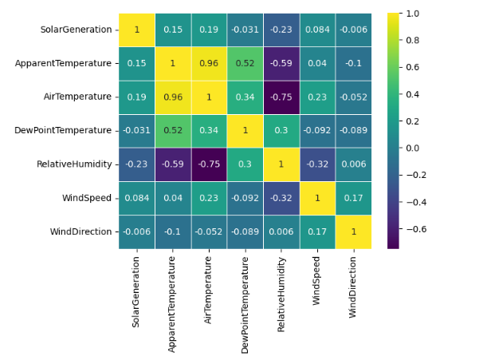
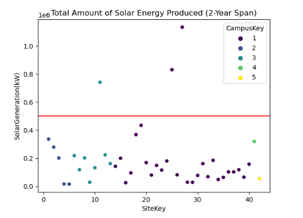
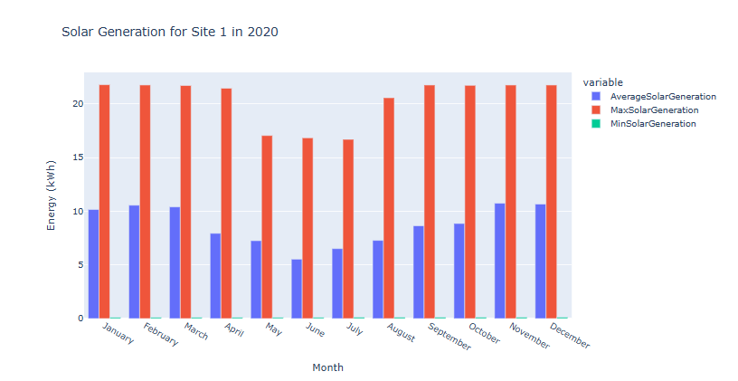

## Dataset
- The UNISOLAR dataset contains high-granularity Photovoltaic (PV) solar energy generation, solar irradiance, and weather data from 42 PV sites deployed across five campuses at La Trobe University, Victoria, Australia. 
- The dataset includes approximately two years of PV solar energy generation data collected at 15-minute intervals. 
- Link: https://www.kaggle.com/datasets/cdaclab/unisolar/data
  
## Business Question
- Is it possible to benchmark and/or enhance operational outcomes in the investigated solar sites?

## Conclusions
### Correlation Analysis 

- Solar generation exhibits a negative correlation coefficient of -0.23 with relative humidity. Higher humidity levels tend to reduce the efficiency of solar cells by creating a thin layer of water on their surface. Research suggests that this effect can decrease efficiency by 10-20% of the total power output.
- Apparent temperature and air temperature show a positive correlation coefficient with solar generation. Increased sunlight exposure leads to higher power generation by solar panels. This typically occurs during the day when the sun is out, allowing solar panels to operate at their maximum capacity.
- Windspeed has a coefficient of 0.084, indicating a positive correlation with solar generation. Wind helps cool solar panels, which can enhance their efficiency. Although the impact on overall solar panel production may be modest, even a slight decrease in temperature can improve efficiency. Over time, these incremental improvements can accumulate.
- Wind direction and dewpoint temperature have minimal to negligible effects on solar generation. Their influence on solar panel efficiency appears to be insignificant compared to other factors such as relative humidity, temperature, and windspeed.

### Energy Production

- 2/3 outliers were found in CampusKey=1 which we have solar site details. Location factor taken into account (lat -37.718287 and lon 145.050975). These sites are located at La Trobe University. 

Due to similar  trends from each site during the investigated span of 3 years (e.g Site 1): 
- Solar generation experiences a noticeable decline from June to September, occasionally starting as early as April or May. This decline coincides with the winter months in different parts of Australia where the data was recorded.
Conversely, solar generation peaks from October to March with relatively stable results.
- Data from 2022 is less comprehensive compared to previous years.
- There is a significant spread between the maximum and average solar generation. This variance is likely due to peaks in generation occurring during late mornings and early afternoons. Solar panels operate at maximum capacity for only a limited number of hours during the day, leading to a decrease in energy production towards the end of the day.

### Recommendations
- Conduct a detailed investigation into the outliers mentioned. A thorough understanding of the factors that contribute to their great performance can assist in enhancing strategies/procedures for other sites.
- Develop strategies to mitigate the impact of seasonal trends on solar generation. They include optimizing energy storage capacity or implementing supplementary energy sources during periods of low solar generation.
- Use the correlation analysis performed above as well as site characteristics to optimize solar panel deployment and operation. Consider factors such as panel orientation and weather conditions to maximize energy generation.
- Improve the data collection to ensure accuracy for all years, with particular attention to gaps observed in 2022.
  

  
